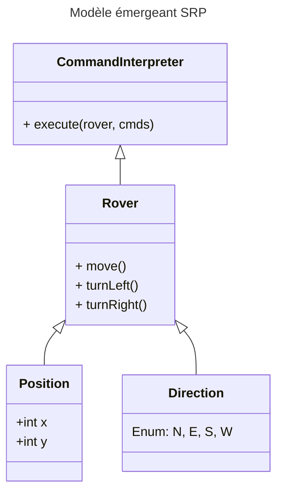

---
# You can also start simply with 'default'
theme: seriph
# random image from a curated Unsplash collection by Anthony
# like them? see https://unsplash.com/collections/94734566/slidev
background: https://cover.sli.dev
# some information about your slides (markdown enabled)
title: Kata - SRP
info: |
  ## Kata rover on SRP
# apply unocss classes to the current slide
class: text-center
# https://sli.dev/features/drawing
drawings:
  persist: false
# slide transition: https://sli.dev/guide/animations.html#slide-transitions
transition: slide-left
# enable MDC Syntax: https://sli.dev/features/mdc
mdc: true
# open graph
# seoMeta:
#  ogImage: https://cover.sli.dev
---

# Code Kata

Single Responsability Principal

  Are you ready ?<carbon:arrow-right />

<!--
Partager la MR du repo kata pour la séance

https://gitlabee.dt.renault.com/irn-71028/kata/rover/-/merge_requests/1
-->

---
transition: fade-out
---

# Sommaire

<Toc minDepth="1" maxDepth="1" />

<!--
-->
---
transition: fade-out
---

# Plan de la séance

Etapes
- Introduction 5 min
- Lecture du code "naîf" 10 min
- Identification des responsabilités 10 min
- Refactoring guidé 30 min
- Tests et validation 10 min
- Debrief & Retours 10 min
 

<v-click>
Supports

- Fiche SRP
- Schéma SRP Rover
- Slides
- Code Java
</v-click>

<!--
-->

---
transition: fade-out
---

# Rappel - Mars Kata Rover

Le Rover doit explorer une grille en obéissant à des commandes :
- M : avancer
- L : tourner à gauche
- R : tourner à droite

Il a une position de départ ainsi qu'une orientation E, N, W, S

 

<v-click>
Aujourd'hui, on va surtout...

➡ Refactorer pour faire émerger Single Responsibility Principle (SRP).

</v-click>

<!--
Expliquer prendre max 10min

Introduire le principes du SRP 

Travail collectif
-->

---
transition: fade-out
layout: image-right
image: /grid.jpg
dragPos:
  square: 861,31,70,62,265
---

# Exemple

Position de départ: (2,1) 

Il regarde vers W

Commandes: RMMLMM

 

<v-click>Où se trouve le rover ?</v-click>

 

<v-click>(0,3) regardant vers W</v-click>

---
transition: fade-out
---

# Single Responsibility Principle

Le SRP pour les intimes ...

C'est quoi pour vous ?

 

<v-click>
Une classe (ou méthode) doit avoir une et une seule responsabilité.

Elle ne devrait avoir qu'une seule raison de changer.
</v-click>

 
<v-click>

Comment détecter un problème de SRP ?

</v-click>

<v-click>

- Trop de "ET" dans la description	Exemple : "Cette classe gère la position ET la direction ET les commandes."

</v-click>
<v-click>

- Les méthodes ont des noms longs ou flous :	Exemple: "executeCommandsAndMoveAndTurn"

</v-click>
<v-click>

- Des changements fréquents dans des zones non liées :	Exemple: Ajout d'un type de mouvement → casse la gestion de position.

</v-click>

<!--
Attendu -> Une classe (ou méthode) doit avoir une et une seule responsabilité. Elle ne devrait avoir qu'une seule raison de changer.

2. Comment détecter une violation SRP 2min

Trop de "ET" dans la description	Exemple : "Cette classe gère la position ET la direction ET les commandes."

Les méthodes ont des noms longs ou flous :	Exemple: "executeCommandsAndMoveAndTurn"

Des changements fréquents dans des zones non liées :	Exemple: Ajout d'un type de mouvement → casse la gestion de position.

-->

---
transition: fade-out
---

# Code de départ brut et naïf

Rover gère

Parcourons ensemble le code

  - Commandes
  - Mouvement
  - Direction
  - Affichage

<v-click>

Identitifons ensemble les différentes responsabilitées, ainsi que les raisons de pourquoi est ce que ce bout de code devrait changer 

</v-click>

<v-click>

|            |                        |
|------------|------------------------|
| Commandes  | Ajouter commande       |
| Direction  | Modifier rotations     |
| Position   | Modifier déplacements  |

</v-click>

<!--
Commencer par parcourir le code de départ

Dire ce que fait le rover:

Commandes, mouvement, direction, affichage

En extraire des responsabilités

Commandes, direction, position
-->

---
transition: fade-out
layout: two-cols
---

# Refacto vers le modèle émergeant du SRP

1. Extraire Direction
2. Extraire Position
3. Réduire Rover
4. Extraire CommandInterpreter

  

::right::

<!--
Laisser afficher pendant le refacto

Faire le tour du modèle vérifier que c'est bon

Lancer la séance solo max 30min
-->

---
transition: fade-out
---

# Let's code !

---
transition: fade-out
layout: center
---

# Pour aller plus loin

Pour aller plus loin:

- Implémenter la gestion d'obstacles
- Faire une carte circulaire
- Ajouter des logs de déplacement

---
transition: fade-out
layout: end
---

# Conclusion
Debrief et retours

 

Où voyez-vous les bénéfices immédiats ?

Où appliquer ces principes dans vos projets ?

<!--
-->

<!--
Laissez parler
-->
